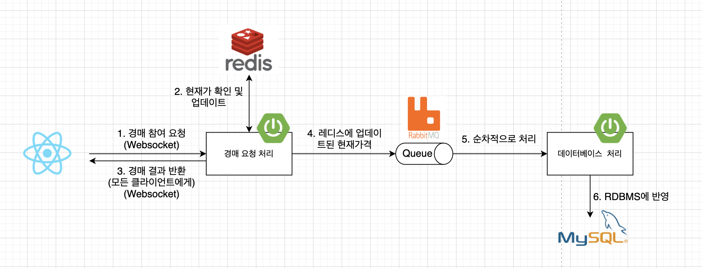
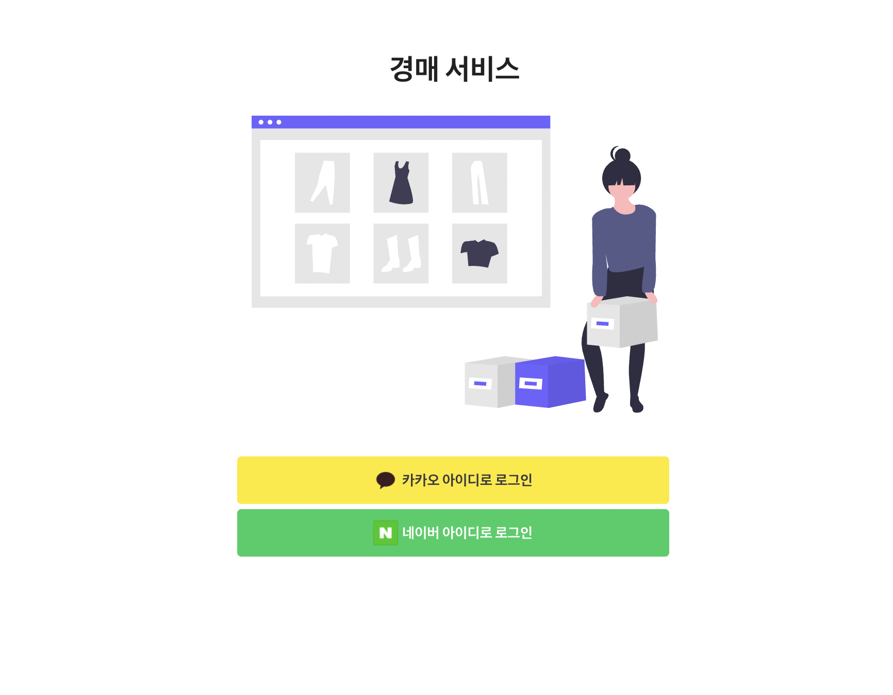

## 설명

개인적으로 진행한 사이드 프로젝트입니다. 백엔드와 프론트엔드를 모두 포함하지만 배포목적의 서비스가 아니다 보니 제가 백엔드 개발자인 만큼 UI보다는 기능적관점 위주의 개발을 진행하였습니다. 백엔드의 테스트코드, API 문서화에 중점을 두고 개발을 진행하였습니다.

다음은 프로젝트 진행에 대한 글입니다.

1. [기능정의](https://youngwonseo.tistory.com/6)
2. [시스템 아키텍처와 프로젝트 세팅](https://youngwonseo.tistory.com/7)
3. [데이터베이스 설계](https://youngwonseo.tistory.com/8)
4. [소셜 로그인 구현 (JWT)](https://youngwonseo.tistory.com/9)
5. [상품목록 (Querydsl, N+1)](https://youngwonseo.tistory.com/10)
6. [경매기능(Websocket, Redis, RabbitMQ)](https://youngwonseo.tistory.com/11)
7. [테스팅과 문서화 (JUnit5, Spring Docs Rest)](https://youngwonseo.tistory.com/12)
8. [프론트엔드 상태관리](https://youngwonseo.tistory.com/13)
9. [결과 UI](https://youngwonseo.tistory.com/14)
10. [무중단 배포와 로드 벨런싱](https://youngwonseo.tistory.com/15)
11. [CI/CD](https://youngwonseo.tistory.com/16)
12. [마무리](https://youngwonseo.tistory.com/17)

## 기술스택

* 백엔드
  * Java8
  * Spring boot
  * Spring Data JPA
  * Spring Data Redis
  * Spring Validation
  * Spring Websocket
  * Spring Security
  * Spring Rest Docs
  * Lombok
  * Querydsl
  * Java JWT
* 프론트엔드
  * Typescript
  * ReactJS
  * Redux-Saga
  * Typesafe Action
  * Axios
  * Socket.io
  * Sementic UI
  * Echart
* 데이터베이스
  * MySql
* Etc
  * Docker
  * Nginx

## 기능
* 로그인
  * 네이버
  * 카카오
* 상품목록 (페이징)
  * 전체 상품
  * 카테고리별 상품목록
  * 경매 참여중인 상품목록
  * 경매 완료된 상품목록
  * 관심(좋아요 활성화) 상품목록
  * 내가 판매중인 상품목록
* 상품검색
  * 상품 이름
  * 상품 판매자
  * 태그 기반
* 상품상세정보
  * 상품 상세정보
  * 해당 상품의 경매관련 정보
* 실시간 경매기능
  * 경매참여
  * 종료시간에 대한 경매종료
* 상품등록
  * 기본 정보 등록
  * 경매 관련 정보 등록
    * 경매 시작/종료 시간
    * 경매 시작가격
  * 이미지 등록
    * 썸네일 저장

## 시스템구성

## 데이터베이스

## 경매처리

## UI

### 로그인

### 상품목록

## References

* [스프링 부트와 AWS로 혼자 구현하는 웹 서비스 - 이동욱지음](http://www.kyobobook.co.kr/product/detailViewKor.laf?ejkGb=KOR&mallGb=KOR&barcode=9788965402602&orderClick=LEa&Kc=)
* [https://github.com/cheese10yun/spring-jpa-best-practices](https://github.com/cheese10yun/spring-jpa-best-practices)
* [Class101 백엔드 실무 - 개발자 푸](https://class101.net/products/T6HT0bUDKIH1V5i3Ji2M)